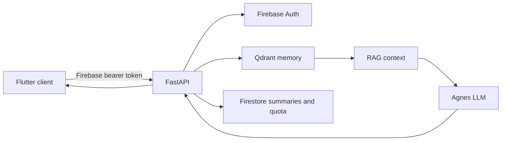

# Aether API

Backend for [Aether](https://github.com/Mosarto/aether), a reflective journal that combines persistent conversations, semantic memory, and structured personal insights.

The API authenticates Firebase users, retrieves relevant memories from Qdrant, builds compact RAG context, generates responses through Agnes, and returns data shaped for the Flutter client.

## What the service does

- Authenticates every user operation with Firebase ID tokens.
- Stores reflections, answers, profiles, sessions, and semantic memories in Qdrant.
- Builds retrieval-augmented prompts with multilingual local embeddings.
- Maintains conversation context with a 20-turn sliding window.
- Compresses longer sessions and updates enriched user profiles in background jobs.
- Generates Akashic Records and specialized dream, aura, stoic, and synchronicity insights.
- Enforces per-user quotas, premium bypass rules, and request rate limits.
- Synchronizes user-facing summaries and account fields with Firestore.

## Request flow



For a chat request, the API validates identity, session ownership, and quota, loads recent turns, retrieves semantic context, builds a compact TOON prompt, requests a model completion, persists both turns, and returns remaining quota with the response.

## Stack

| Component | Purpose |
|---|---|
| FastAPI and Uvicorn | HTTP application and lifecycle management |
| Qdrant | Vector storage for reflections, memories, conversations, and profiles |
| FastEmbed | Local multilingual embeddings, 384 dimensions |
| Agnes | LLM provider (OpenAI-compatible chat completions) for chat and background generation |
| Firebase Admin | Token verification, Firestore profiles, summaries, and quotas |
| Docker Compose | Local and production service orchestration |

## LLM integration

All completions go through a single async layer, `app/llm.py`:

- One provider (Agnes), one model (`AGNES_MODEL`) for every flow — chat,
  structured tasks, and background jobs.
- Use cases are differentiated by policies (temperature, max_tokens, timeout,
  retries), not by different models.
- Endpoint is built exactly once from `AGNES_BASE_URL` (trailing slash
  tolerated) as `{base}/chat/completions`, with `Authorization: Bearer` and
  the `max_tokens` parameter.
- Transient failures (408, 429, 500, 502, 503, 504, 520, 522, 524, timeouts,
  connection errors) retry with exponential backoff, honoring a capped
  `Retry-After`. Permanent errors (400, 401, 403, 404, …) never retry.
- Structured outputs are parsed strictly and validated with Pydantic; an
  invalid answer gets exactly one corrective retry at lower temperature.
- When Agnes is unavailable the API answers `503 {"error": "llm_unavailable"}`
  and refunds the reserved quota slot.
- Logs and errors never contain credentials, prompts, or user content.

## Quick start with Docker

### Prerequisites

- Docker Engine with Compose
- Agnes API key
- Firebase service account
- Qdrant API key for the Compose stack

### 1. Clone and create the environment file

```bash
git clone https://github.com/Mosarto/aether_api.git
cd aether_api
cp .env.example .env
```

PowerShell equivalent:

```powershell
Copy-Item .env.example .env
```

At minimum, configure:

```dotenv
AGNES_API_KEY=your_agnes_key
AGNES_BASE_URL=https://apihub.agnes-ai.com/v1
AGNES_MODEL=agnes-2.5-flash
QDRANT_API_KEY=local-development-key
FIREBASE_SERVICE_ACCOUNT_JSON=<complete-minified-service-account-json>
ALLOWED_ORIGINS=http://localhost:3000,http://localhost:8080
```

For Docker, place the complete minified Firebase service-account JSON in `FIREBASE_SERVICE_ACCOUNT_JSON`. Keep it only in `.env`; the file is ignored by Git.

### 2. Start the local stack

```bash
docker compose -f docker-compose.local.yml up --build
```

Services become available at:

- API: `http://localhost:8000`
- Health: `http://localhost:8000/health`
- Swagger UI: `http://localhost:8000/docs`
- Qdrant: `http://localhost:6333`

The first start downloads the embedding model, so it takes longer than later starts.

## Run without Docker

Start Qdrant separately, then create a Python 3.12 environment.

```bash
python -m venv .venv
source .venv/bin/activate
pip install -r requirements.txt
export AGNES_API_KEY="your_agnes_key"
export AGNES_BASE_URL="https://apihub.agnes-ai.com/v1"
export AGNES_MODEL="agnes-2.5-flash"
export QDRANT_API_KEY="your_qdrant_key"
export FIREBASE_SERVICE_ACCOUNT_PATH="serviceAccountKey.json"
export DEBUG=1
uvicorn main:app --reload --host 0.0.0.0 --port 8000
```

PowerShell:

```powershell
python -m venv .venv
.\.venv\Scripts\Activate.ps1
pip install -r requirements.txt
$env:AGNES_API_KEY = "your_agnes_key"
$env:AGNES_BASE_URL = "https://apihub.agnes-ai.com/v1"
$env:AGNES_MODEL = "agnes-2.5-flash"
$env:QDRANT_API_KEY = "your_qdrant_key"
$env:FIREBASE_SERVICE_ACCOUNT_PATH = "serviceAccountKey.json"
$env:DEBUG = "1"
uvicorn main:app --reload --host 0.0.0.0 --port 8000
```

The default Qdrant URL is `http://localhost:6333`.

## Configuration

| Variable | Required | Default | Description |
|---|---:|---|---|
| `AGNES_API_KEY` | Yes | — | Agnes credential. Startup stops when absent. |
| `AGNES_BASE_URL` | Yes | — | Agnes OpenAI-compatible base URL (includes `/v1`; trailing slash tolerated). |
| `AGNES_MODEL` | Yes | — | Model for every AI flow. Recommended: `agnes-2.5-flash`. |
| `AGNES_TIMEOUT_SECONDS` | No | `45` | Completion timeout. |
| `AGNES_MAX_RETRIES` | No | `2` | Retries for transient failures (408/429/5xx, timeouts). |
| `AGNES_STARTUP_PROBE` | No | Disabled | Opt-in 1-token boot probe. Costs tokens; keep off. |
| `QDRANT_URL` | No | `http://localhost:6333` | Qdrant endpoint. Compose overrides it with the service hostname. |
| `QDRANT_API_KEY` | Compose/production | Empty | Qdrant authentication key shared by the API and Qdrant service. |
| `FIREBASE_SERVICE_ACCOUNT_PATH` | One Firebase option | `serviceAccountKey.json` | Local service-account file. |
| `FIREBASE_SERVICE_ACCOUNT_JSON` | One Firebase option | Empty | Full service-account JSON for deployment platforms. Takes precedence over the path. |
| `ALLOWED_ORIGINS` | No | Localhost origins | Comma-separated CORS allowlist. Set explicitly in production. |
| `DEBUG` | No | Disabled | Enables Swagger and ReDoc routes. |

Do not commit `.env` or `serviceAccountKey.json`.

## Firebase setup

1. Open Firebase Console and create or select a project.
2. Enable Authentication and Firestore.
3. Create a service account under **Project settings > Service accounts**.
4. For local Python development, save the JSON as `serviceAccountKey.json`.
5. For Docker or deployment, set `FIREBASE_SERVICE_ACCOUNT_JSON` to the complete JSON value.

The service account must be able to verify users and read/write the Firestore documents used for profiles, summaries, and quota tracking.

## Authentication

All product endpoints require a Firebase ID token:

```http
Authorization: Bearer <firebase-id-token>
```

The API derives the user ID from the verified token. Request bodies must not supply or override ownership fields. Session reads, continuations, and deletions are always scoped to the authenticated owner.

`GET /health` is the only unauthenticated route. It performs non-billable readiness checks and never invokes LLM completions.

## Endpoints

| Method | Path | Purpose |
|---|---|---|
| `GET` | `/health` | API, Qdrant, Agnes configuration, embedding, and Firebase readiness |
| `GET` | `/reflections/{reflection_id}/exists` | Check whether a reflection is indexed |
| `POST` | `/reflections` | Index a structured reflection |
| `POST` | `/user-answers` | Store a reflection answer as user memory |
| `POST` | `/chat` | Run the authenticated Nyx chat pipeline |
| `GET` | `/conversations` | List the current user's sessions |
| `GET` | `/conversations/{session_id}` | Load an owned session and its turns |
| `DELETE` | `/conversations/{session_id}` | Delete an owned session |
| `POST` | `/generate-prompt` | Generate a structured reflection prompt |
| `POST` | `/ai/dream` | Analyze dream content |
| `POST` | `/ai/aura` | Generate an emotional-state reading |
| `POST` | `/ai/stoic` | Generate stoic guidance |
| `POST` | `/ai/sync` | Interpret recurring patterns or synchronicities |
| `GET` | `/user/profile` | Return the enriched semantic profile |
| `GET` | `/user/quota` | Return current quota state |
| `DELETE` | `/user/account` | Permanently erase the caller's data (see below) |

When Agnes is unavailable, LLM-backed endpoints answer `503` with body `{"error": "llm_unavailable"}` (wrapped in `detail` by FastAPI) and the quota slot is refunded.

### Chat example

```bash
curl -X POST http://localhost:8000/chat \
  -H "Authorization: Bearer $FIREBASE_ID_TOKEN" \
  -H "Content-Type: application/json" \
  -d '{
    "message": "I keep repeating the same decision pattern. Help me examine it.",
    "sessionId": null,
    "reflectionId": null
  }'
```

Example response:

```json
{
  "response": "...",
  "sessionId": "9cb6203f-2e3c-4bc5-aee0-8a456d9c392c",
  "sessionTitle": "Recurring decisions",
  "model": "agnes-2.5-flash",
  "contextSources": 4,
  "followUp": ["Which part of the pattern feels familiar?"],
  "remaining": 8
}
```

## Account deletion

`DELETE /user/account` erases everything keyed by the caller's uid, which the
API takes from the verified token — a user can only delete themselves:

| Store | What is removed |
|---|---|
| Qdrant `conversations` | Session metadata and every turn |
| Qdrant `user_memories` | Answers and durable personal context |
| Qdrant `user_profiles` | The enriched semantic profile |
| Firestore `users/{uid}` | Document and all subcollections (settings, tracker, summaries, chat_sessions, quota) |
| Firebase Auth | The account itself, deleted last |

The shared `reflections` catalog is intentionally preserved: it is product
content consumed by every user, not personal data.

The purge verifies that no points remain and returns `500
{"error": "account_deletion_incomplete"}` if any store failed, so the client
never tells a user their data is gone while part of it survives. The operation
is idempotent — a failed attempt can be retried while the account still exists.

## Memory and data model

Qdrant uses four logical collections:

- Reflections: system-authored and generated reflection material.
- User memories: answers and durable personal context.
- Conversations: session metadata and individual turns.
- User profiles: LLM-enriched personality, emotional state, recurring themes, and progress.

Firestore remains the source for account-facing fields, subscription state, quota state, and generated summaries consumed by the mobile app.

## Startup

Startup validates dependencies without spending tokens:

1. Validate required configuration (`AGNES_*` presence — values are never logged).
2. Connect to Qdrant.
3. Initialize Firebase when configured.
4. Load or verify the embedding model.
5. Create the shared async LLM client.
6. Start profile and daily-insight background jobs.

The process exits when a required dependency is missing. No completions run on boot; set `AGNES_STARTUP_PROBE=1` for an explicit opt-in 1-token probe.

## Tests

Tests are a separate `pytest` suite (they no longer run on boot) and mock Agnes with `httpx.MockTransport` — no tokens are spent:

```bash
pip install -r requirements-dev.txt
pytest
```

Coverage includes: configuration validation, base-URL normalization, Bearer/`max_tokens` request shape, retry/backoff/`Retry-After` behavior, permanent-error handling, structured-output corrective retry, health-check cost safety, session-ownership isolation, quota refund, prompt-injection hardening, and absence of legacy providers.

## Project structure

```text
.
├── main.py                    FastAPI app, CORS, routers
├── app/
│   ├── auth.py               Firebase bearer authentication
│   ├── background.py         Expired-session profile processing
│   ├── config.py             Environment, constants, and prompts
│   ├── daily_verse.py        Scheduled personalized insight job
│   ├── firebase.py           Firebase Admin and Firestore access
│   ├── llm.py                Central Agnes layer: client, policies, retries
│   ├── llm_schemas.py        Pydantic schemas for structured LLM outputs
│   ├── models.py             Pydantic request and response contracts
│   ├── profile.py            Enriched profile lifecycle
│   ├── providers.py          Qdrant client
│   ├── quota.py              Daily and premium quota rules (+ refund)
│   ├── rag.py                Retrieval and prompt assembly
│   ├── rate_limit.py         Per-user protection
│   ├── startup.py            Readiness checks and lifespan
│   ├── toon.py               Compact text serialization
│   └── routes/               HTTP endpoint groups
├── tests/                    Pytest suite (Agnes mocked)
├── Dockerfile
├── docker-compose.yml
├── docker-compose.local.yml
├── requirements.txt
└── .env.example
```

## Production deployment

The production Compose file expects the external `dokploy-network` network and does not expose Qdrant publicly.

Before deployment:

1. Set all required environment variables in the platform secret store.
2. Set a restrictive `ALLOWED_ORIGINS` value.
3. Keep `DEBUG` disabled.
4. Use a strong `QDRANT_API_KEY`.
5. Provide Firebase through `FIREBASE_SERVICE_ACCOUNT_JSON`.
6. Persist the `qdrant_data` volume and configure backups.
7. Confirm `/health` returns `200` after startup completes.

## Troubleshooting

| Symptom | Check |
|---|---|
| Startup reports missing Agnes config | Confirm `.env` is loaded and `AGNES_API_KEY`, `AGNES_BASE_URL`, `AGNES_MODEL` are non-empty. |
| LLM endpoints return 503 `llm_unavailable` | Agnes unreachable/erroring; check provider status and credentials. Quota was refunded. |
| Qdrant is unreachable | Confirm the container is healthy and `QDRANT_URL` matches the execution mode. |
| Firebase is not configured | Verify the service-account path or JSON environment variable. |
| `/docs` returns 404 | Set `DEBUG=1` for local development. |
| First boot is slow | FastEmbed may be downloading and loading the multilingual model. |

## License

Released under the [MIT License](LICENSE).
